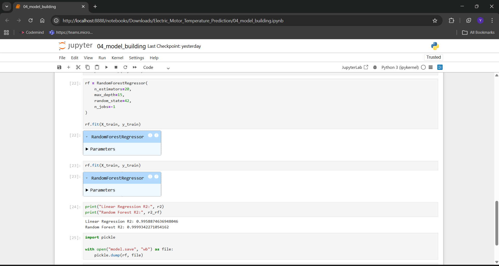
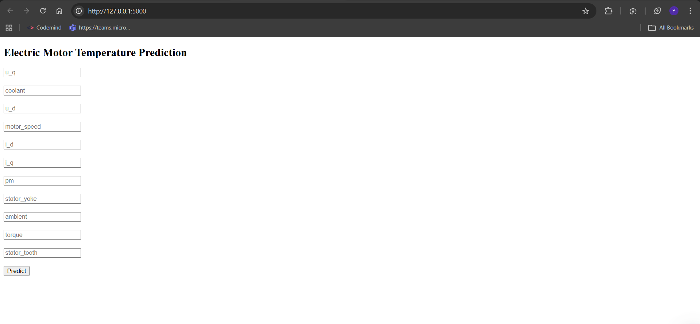

Electric Motor Temperature Prediction Using Machine Learning

This project aims to predict the temperature of an electric motor based on operational and environmental parameters. The solution helps in predictive maintenance, preventing overheating, and improving motor reliability in industrial systems.

By analyzing historical motor data, machine learning models were trained to accurately estimate motor temperature.

 Project Demo Video

[Add your Google Drive demo video link here]

 Team Details

| Role | Name |
|------|------|
| Team ID | LTVIP2026TMIDS74581 |
| Team Leader | Satya Siva Sai Ganesh Valluri |
| Team Member | Marise Radha Vaishnawe|
| Team Member | Velagala Jyothi Ayyappa Swarupa Reddy |
| Team Member | Kommanapalli Yeswanth Ganesh |
| Faculty Mentor | Anji Babu |

Project Structure
Electric-Motor-Temperature-Prediction/
│
├── dataset/                                # Dataset (not uploaded due to size)
│
├── Flask/
│   ├── templates/
│   │   └── index.html                      # Web interface
│   ├── app.py                              # Flask application
│   └── requirements.txt                    # Required dependencies
│
├── screenshots/
│   ├── model_evaluation.png
│   ├── flask_prediction.png
│
├── 01_data_loading.ipynb                   # Data loading notebook
├── 03_data_preprocessing.ipynb             # Data preprocessing notebook
├── 04_model_building.ipynb                 # Model training & evaluation
│
├── model.save                              # Saved trained model (optional)
└── README.md
## 🛠 Technologies Used

| Category | Technology |
|----------|------------|
| Language | Python |
| ML Libraries | NumPy, Pandas, Scikit-learn |
| Visualization | Matplotlib, Seaborn |
| Model | Random Forest Regressor |
| Web Framework | Flask |
| Deployment | Render |
| Serialization | Joblib |
| Environment | Jupyter Notebook |

##  Project Setup

### 1️⃣ Clone Repository
git clone https://github.com/your-username/Electric-Motor-Temperature-Prediction.git

### 2️⃣ Install Dependencies
pip install -r requirements.txt

### 3️⃣ Run Flask App
cd Flask
python app.py

Open:
http://127.0.0.1:5000
## 📸 Project Output

### Model Evaluation

### Flask Application Output

python app.py

Open:

http://127.0.0.1:5000
